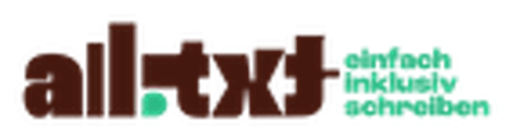
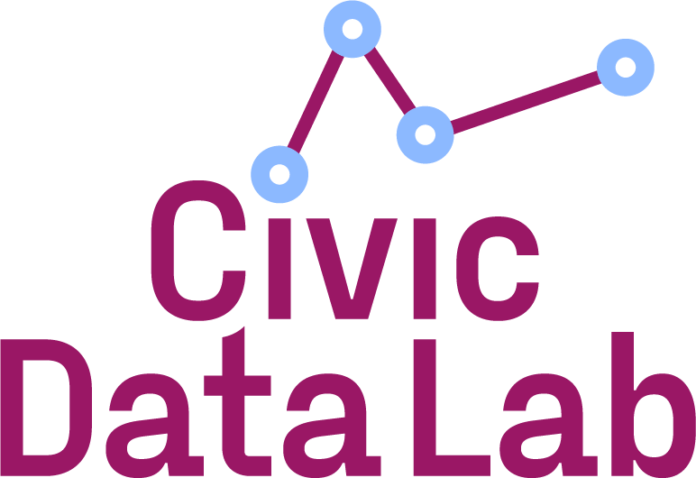

# gender-sensitive-language

## Description
Open Data for gender-sensitive and gender-inclusive language in German.  
  
*Disclaimer: Since the dataset is in German, the rest of the README is in German.*

## Metadaten
**Beschreibung:** Der Datensatz enthält Wörter und Beispielsätze in gendergerechter deutscher Sprache. Mehr Infos unter [Datensatz](https://github.com/NevenaNik/gender-sensitive-language/tree/main?tab=readme-ov-file#datensatz).  
**Schlagworte:** Open Data, gendergerechte Sprache, genderinklusive Sprache, genderneutrale Sprache, NLP  
**Kategorie:** Sprache, Open Data  
**Lizenz:** [CC BY-NC-SA](https://creativecommons.org/licenses/by-nc-sa/4.0/)  
**Dateiformate:** CSV  
**Letzte Änderung:** 2024-08-15  
**Herausgebende Organisationen:** [all.txt](https://www.all-txt.de) in Kooperation mit dem [Civic Data Lab](https://civic-data.de)  
**Kontakt:** [info@all-txt.de](info@all-txt.de) // [mail@civic-data.de](mail@civic-data.de)  

## Datensatz
Der Datensatz besteht aus zwei Teilen.  
  
Der erste Teildatensatz ***words.csv*** enthält eine Sammlung von 2.046 Begriffen, die jeweils in ***neutraler***, ***maskuliner***, ***femininer*** und ***inklusiver*** Form vorliegen. Für die inklusive Form sind jeweils die folgenden gängigen Schreibweisen enthalten *inklusiv* ***mit Doppelpunkt***, *inklusiv* ***mit Unterstrich***, *inklusiv* ***mit Sternchen***, *inklusiv* ***mit Schrägstrich*** und *inklusiv* ***mit Großbuchstaben***.  

| Form | Beispiel |
| ----------- | ----------- |
| neutral | Studierende |
| maskulin | Studenten |
| feminin | Studentinnen |
| inkl. mit Doppelpunkt | Student:innen |
| inkl. mit Unterstrich | Student_innen |
| inkl. mit Sternchen | Student*innen |
| inkl. mit Schrägstrich | Student/innen |
| inkl. mit Großbuchstaben | StudentInnen |
  
  
Der zweite Teildatensatz ***sentences.csv*** baut auf dem ersten Teildatensatz auf und enthält für jeden Begriff einen Beispielsatz in jeder Form. Die enthaltenen Formen entsprechen denen des ersten Teildatensatzes. Für jeden Satz wurde die jeweilige Form konsistent verwendet.

| Form | Beispiel |
| ----------- | ----------- |
| neutral | Die Workshopleitung erklärte den Teilnehmenden die Ziele und den Ablauf des Seminars. |
| maskulin | Der Workshopleiter erklärte den Teilnehmern die Ziele und den Ablauf des Seminars. |
| feminin | Die Workshopleiterin erklärte den Teilnehmerinnen die Ziele und den Ablauf des Seminars. |
| inkl. mit Doppelpunkt | Dier Workshopleiter:in erklärte den Teilnehmer:innen die Ziele und den Ablauf des Seminars. |
| inkl. mit Unterstrich | Dier Workshopleiter_in erklärte den Teilnehmer_innen die Ziele und den Ablauf des Seminars. |
| inkl. mit Sternchen | Dier Workshopleiter'*in erklärte den Teilnehmer'*innen die Ziele und den Ablauf des Seminars. |
| inkl. mit Schrägstrich | Dier Workshopleiter/in erklärte den Teilnehmer/innen die Ziele und den Ablauf des Seminars. |
| inkl. mit Großbuchstaben | Dier WorkshopleiterIn erklärte den TeilnehmerInnen die Ziele und den Ablauf des Seminars. |

## Beschreibung
Der Datensatz entstand in Kooperation zwischen [all.txt](https://www.all-txt.de) und dem [Civic Data Lab](https://civic-data.de) (siehe dazu: [Artikel zum Datenvorhaben](https://civic-data.de/all-txt/)). Mit der Veröffentlichung des Datensatzes möchten wir einen Beitrag dazu leisten, die deutsche Sprache um genderneutrale und genderinklusive Formulierungen zu bereichern und so das Verständnis von Gender zu fördern. Der Datensatz kann als Grundlage für Deep Learning Modelle verwendet werden.  
  
Im Rahmen des Datensatzes wird das ***Del-On-Sel-System*** verwendet. 
> [Dieses] ist ein Vorschlag, die deutsche Sprache um leicht aussprechbare geschlechtsneutrale Wörter zu erweitern. Dafür werden neue Substantive mit der Endung -on eingeführt, wobei als neuer Artikel del (statt der/die) und als neues Pronomen sel (statt er/sie) verwendet wird. (Quelle: [Verein für Geschlechtsneutrales Deutsch e.V.](https://geschlechtsneutral.net)).

## Ressourcen
- [Verein für Geschlechtsneutrales Deutsch e.V.](https://geschlechtsneutral.net)
- [Nonbinary Wiki](https://nonbinary.wiki/wiki/Main_Page)

## Lizenz
Der Datensatz wird unter folgender Lizenz veröffentlicht: [CC BY-NC-SA](https://creativecommons.org/licenses/by-nc-sa/4.0/).

## Über die Organisationen
### all.txt
[all.txt](https://www.all-txt.de) ist ein Gender-Inklusivitäts-Co-Pilot, der speziell entwickelt wurde, um Inklusivität beim Schreiben zu fördern und sicherzustellen, dass jede Person angemessen durch Texte angesprochen und gesehen wird. Durch den Einsatz modernster KI-Technologie ermöglicht all.txt den Nutzenden, inklusivere und respektvollere Inhalte zu erstellen. Mit der Unterstützung von all.txt lernst du kontinuierlich, durch regelmäßige Praxisanwendung und unsere umfassenden Lernmaterialien und Erklärungen, um ein lebenslanges Engagement für Inklusivität zu fördern.

### Civic Data Lab
Mit dem [Civic Data Lab](https://civic-data.de) (CDL) unterstützt das Bundesministerium für Familie, Senioren, Frauen und Jugend (BMFSFJ) die Zivilgesellschaft, Daten zu erheben, zu nutzen und weiterzugeben. 
Das CDL wird umgesetzt von der [Gesellschaft für Informatik e.V.](https://gi.de), dem [Deutschen Caritasverband e.V.](https://www.caritas.de) und [CorrelAid e.V.](https://www.correlaid.org) Es bringt Akteur:innen aus verschiedenen Bereichen der Zivilgesellschaft und gemeinwohlorientierte Initiativen rund um das Thema der sinnvollen Datennutzung zusammen. Es leistet seinen Teil zur Transformation und Entwicklung der Zivilgesellschaft im Umgang und der Nutzung von und mit Daten.
  

